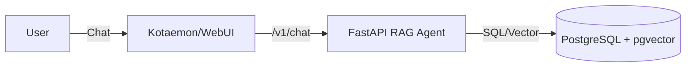

# Internal Intelligent Search Agent (RAG)

A secure, retrieval-augmented generation (RAG) agent designed for internal enterprise environments. It aggregates knowledge from **Confluence** and **Jira**, applying strict **Document Level Security (ACL)** to ensure users only access information they are authorized to see.

## 🚀 Key Features

- **Hybrid Search**: Combines semantic understanding (Vector Search via `pgvector`) and precise keyword matching (Full-Text Search).
- **Security First**: Native ACL support. Documents are indexed with their permissions, and search results are filtered *before* they reach the LLM.
- **OpenAI Compatible API**: Exposes a `/v1/chat/completions` endpoint, making it plug-and-play compatible with UIs like **Kotaemon**, **Open WebUI**, or **LibreChat**.
- **Mock Implementation**: Includes mock loaders and embeddings for rapid prototyping and testing without external API dependencies.

## 🛠️ Architecture

The system consists of a **FastAPI** backend and a **PostgreSQL (pgvector)** database, designed to be containerized alongside a frontend UI.



For a detailed breakdown of the internal flow and function call structure, see [detailed_design.md](../.gemini/antigravity/brain/4eec2909-c67a-415d-a5fe-256593a3ee28/detailed_design.md).

## 🏁 Quick Start

### Prerequisites
- Docker & Docker Compose
- Python 3.12+ (for local development)

### 1. Run with Docker Compose
The easiest way to start the full stack (Frontend + Backend + DB).

```bash
docker compose up -d
```
> **Note**: If you are on an ARM64 machine (e.g., Apple Silicon), the `kotaemon` service may require emulation. We have added `platform: linux/amd64`, but performance may vary.

### 2. Manual Verification (Backend)
Once the backend is running on `http://localhost:8000`:

```bash
# Test as a 'Developer' (Access to JIRA-555)
curl -X POST http://localhost:8000/v1/chat/completions \
  -H "Content-Type: application/json" \
  -d '{
    "model": "rag-agent",
    "messages": [{"role": "user", "content": "is jira 555 done?"}],
    "user": "dev"
  }'
```

### 3. Running Tests
```bash
# Install dependencies
pip install -r backend/requirements.txt

# Run Unit & Integration Tests
PYTHONPATH=backend pytest backend/tests/
```

## 📂 Project Structure

- `backend/app/main.py`: API Gateway.
- `backend/app/rag.py`: Core RAG logic (Retrieval, Reranking, Generation).
- `backend/app/search_service.py`: Hybrid search implementation with RRF.
- `backend/app/ingestion.py`: ETL pipeline for processing documents.
- `docker-compose.yml`: Orchestration for app and database.

## 🔒 Security

Access Control is handled via metadata filtering in `search_service.py`:
```python
session.query(DocumentChunk).filter(
    text("metadata->'allowed_groups' ?| :groups")
)
```
This ensures strict data isolation at the database level.
